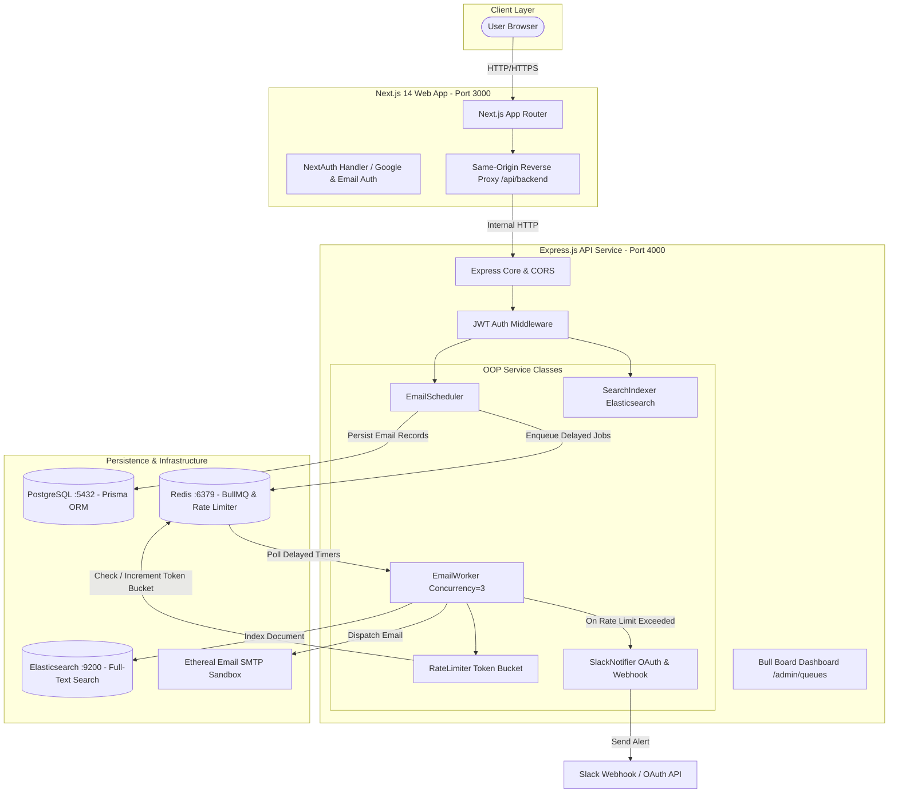

# 🏛 System Architecture & Design Deep Dive

MailFlow is architected as a distributed, high-throughput email scheduling platform designed to handle large email batches while guaranteeing **zero cron reliance**, **strict idempotency**, **sliding-window rate limiting**, and **restart persistence**.

---

## 📐 High-Level Architecture Diagram



---

## 1. ⏱️ Scheduling Engine — Zero Cron Delayed Jobs

Traditional email schedulers rely on `cron`, `node-cron`, or periodic polling loops that scan databases every minute. This approach does not scale and introduces latency jitter.

### How BullMQ Delayed Jobs Work in MailFlow:
1. When a user schedules an email batch for `startTime` with an interval `delayMs`:
   - For recipient $i$, the target dispatch timestamp is:
     $$\text{scheduledFor} = \text{startTime} + (i \times \text{delayMs})$$
2. The exact delay in milliseconds from the current moment is computed:
   $$\text{delay} = \max(0, \text{scheduledFor} - \text{Date.now}())$$
3. The job is registered directly with BullMQ:
   ```typescript
   await this.queue.add('send-email', payload, {
     jobId: idempotencyKey,
     delay: delayFromNow,
     attempts: 3,
     backoff: { type: 'exponential', delay: 5000 },
     removeOnComplete: { age: 86400 },
     removeOnFail: { age: 604800 },
   });
   ```
4. Redis stores the delayed job in a sorted set (ZSET) keyed by epoch trigger time.
5. When the delay expires, Redis automatically moves the job into the active queue for the worker to process immediately.

---

## 2. 🛡️ Deterministic Idempotency & Deduplication

To prevent duplicate email dispatches under network retries, page refreshes, or server restarts:

```typescript
const idempotencyKey = crypto
  .createHash('sha256')
  .update(`${senderId}:${recipient}:${subject}:${scheduledFor.toISOString()}`)
  .digest('hex');
```

- **Database Uniqueness**: `ScheduledEmail` table enforces `@@unique([idempotencyKey])`. Duplicate requests are blocked at the database layer.
- **Queue Uniqueness**: BullMQ uses `idempotencyKey` as its `jobId`. If a job with the same ID already exists in Redis, BullMQ automatically rejects duplicate insertion.

---

## 3. 🔄 Restart Persistence (Crash-Safe)

Because all job state lives in Redis:
1. When the Express backend restarts, it reconnects to Redis and resumes delayed job timers.
2. **No boot-time database scanning**: MailFlow intentionally avoids scanning the database on boot to re-enqueue jobs, eliminating race conditions and double sends.

---

## 4. 🚰 Rate Limiting & Concurrency Architecture

MailFlow implements a sliding-window token bucket in Redis:

- **Redis Key Pattern**: `ratelimit:{senderId}:{YYYY-MM-DDTHH}`
- **Algorithm**:
  1. Worker receives a job and checks `GET ratelimit:{senderId}:{currentHour}`.
  2. If $\text{count} \ge \text{MAX\_EMAILS\_PER\_HOUR\_PER\_SENDER}$ (e.g. 50):
     - **The job is NOT dropped or failed**.
     - It is rescheduled into the start of the next hour window, preserving relative intra-hour offsets.
     - A live alert is dispatched to the user's connected Slack workspace.
  3. If within the limit:
     - The email is sent via SMTP.
     - `INCR` increments the counter, and `EXPIRE` sets the TTL to the remainder of the hour.

---

## 5. 🔍 Elasticsearch Search Indexing

- All scheduled and sent emails are automatically indexed into Elasticsearch (`emails` index).
- Multi-match queries allow full-text search across subject, body, recipient, and sender fields with sub-millisecond latency.
